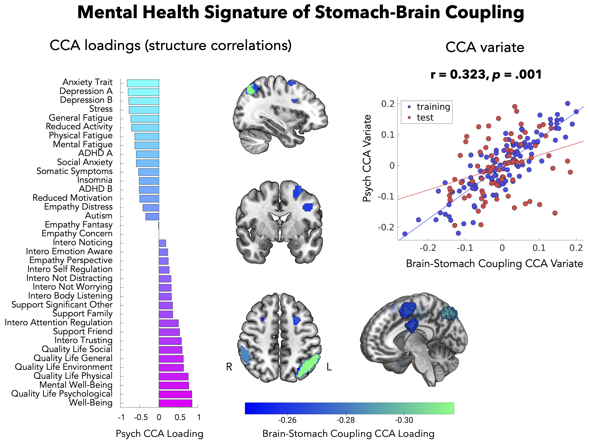

# Increased Stomach-Brain Coupling Indexes a Dimensional Signature of Negative Mental Health 

### Abstract
Visceral rhythms orchestrate the physiological states underlying human emotion. Chronic aberrations in these brain-body interactions are implicated in a broad spectrum of mental health disorders. However, the specific contributions of gastric-brain coupling to affective symptoms remain poorly understood. We investigated the relationship between this novel interoceptive axis and mental health in 243 participants, using a cross validated machine learning approach. We find that frontal parietal brain coupling to the gastric rhythm indexes a dimensional signature of mental health spanning anxiety, depression, stress, and well-being. Control analyses confirm the specificity of these interactions to the gastric-brain axis. Our study proposes coupling between the stomach and brain as a factor in mental health and offers potential new targets for interventions remediating aberrant brain-body coupling.

## Summary of Repository

This repository contains:
- data (EGG, control neurological, stomach-brain coupling, (mental health data upon reasonable request))
- figures (CCA input and results figures, methods figures, and final figures for manuscript)
- results (details of results from CCA analysis)
- scripts (ReadMe.md in this folder details order of scripts to run)

## Preprint:

Link to [preprint](https://www.biorxiv.org/content/10.1101/2024.06.05.597517v3)

Cite as:
Banellis, L., Rebollo, I., Nikolova, N., & Allen, M. (2024). Increased stomach-brain coupling indexes a dimensional signature of negative mental health symptoms. bioRxiv, 2024-06.

## Figures

### Figure 1:
|   |
|:--:| 
| Figure 1: Canonical Correlation Analysis of stomach-brain coupling and mental health. |
>A) Figure 1 synthesises the process and outcomes of correlating stomach-brain phase coupling with mental health, as quantified by 37 variables from 16 validated surveys. The top left quadrant presents these variables organised into their respective mental health categories (categorised for visualisation only, the CCA incorporated 37 individual scores), and their distribution is visualised as histograms on the bottom left, reflecting the range of participant mental health profiles. Electrogastrography (EGG) data depicted on the top right demonstrates the extraction of gastric cycle frequency from raw EGG signals, power spectra, and their phase information, essential for identifying stomach-brain coupling. The middle right figure illustrates coupled versus uncoupled states in stomach-brain interaction, with the individual variability in coupling strength highlighted across three brain images from individual participants (plotted on a standard mni152 brain template using MRIcroGL: visualised MNI coordinates plotted: 28, -19, 26, thresholded at 0.1, and small clusters <1000mm3 removed). For the CCA, stomach-brain phase-coupling is parcellated over 209 brain regions identified using the DiFuMo atlas, shown on the bottom right. The CCA model, depicted centrally, outputs a stomach-brain signature correlating with mental health individual profiles. This pattern is represented by canonical variates, which are weighted combinations of the multidimensional mental health and stomach-brain coupling data (illustrated as the central scatter plot). These weights, depicted as bar graphs, capture the most significant relationships between gastric-brain coupling and mental health profiles.

### Figure 2:
|  |
|:--:| 
| Figure 2: Mental health functional correlate of stomach-brain coupling. |
>A) Canonical Correlation Analysis results depicting the correlation between stomach-brain coupling and mental health dimensions. Left panel depicts the CCA loadings (structure correlations: Pearson's correlations between raw mental health and stomach-brain coupling variables and their respective canonical variate). Importantly, this represents the pattern of mental health data that is maximally correlated with the stomach-brain coupling canonical variate. High negative loadings are shown for anxiety, depression, stress, fatigue, ADHD, somatic symptoms, and insomnia, while high positive loadings are shown for well-being and quality of life. The middle panel shows the top 5 DiFuMo parcellated regions with the absolute highest stomach-brain coupling loadings (all negative), coloured according to their respective CCA loading: left superior angular gyrus, right posterior supramarginal gyrus, left inferior precentral sulcus, left posterior superior frontal gyrus and left posterior intraparietal sulcus (plotted on a standard mni152 brain template using MRIcroGL: MNI coordinates: -34, -3, 48). Right depicts the cross-validated CCA result denoting the maximally correlated psychological variate and brain-stomach coupling variate (in-sample r (118) = 0.886, out-sample r (77) = 0.323, p = 0.001).

### Figure 3:
|  |
|:--:| 
| Figure 3: CCA loadings averaged summary. |
>Canonical loadings (structure correlations: Pearson's correlations between raw inputted variables and respective canonical variate) from the mental health associated stomach-brain coupling CCA, summarised via averaging. Left shows the stomach-brain loadings averaged according to yeo-7 networks. Above demonstrates these network-averaged stomach-brain loadings projected onto a mask of the DiFuMo regions for each yeo-7 network (from left to right: DorsAttnB = Dorsal Attention B, ContA = Control A, SalVentAttnA = Salience Ventral Attention A, SomMotA = Somatomotor A, NoNetwork = no network found, VisCent = Visual A, DefaultB = Default Mode B, LimbicA = Limbic A)41, plotted on a standard mni152 brain template using MRIcroGL: MNI coordinates: -34, -3, 48. Right illustrates the psychological loadings averaged across mental health categories defined for visualisation in Figure 1. Note that there are prominent negative average stomach-brain loadings in the ‘dorsal attention B’ network and the ‘control A’ network, associated with reduced average depression, stress, anxiety, fatigue, and increased average well-being and quality of life (i.e. better mental health). The opposite pattern is also true: increased average stomach-brain loadings in attention and control networks is associated with worse mental health (increased depression, stress, anxiety, fatigue, and reduced well-being, and quality of life).
